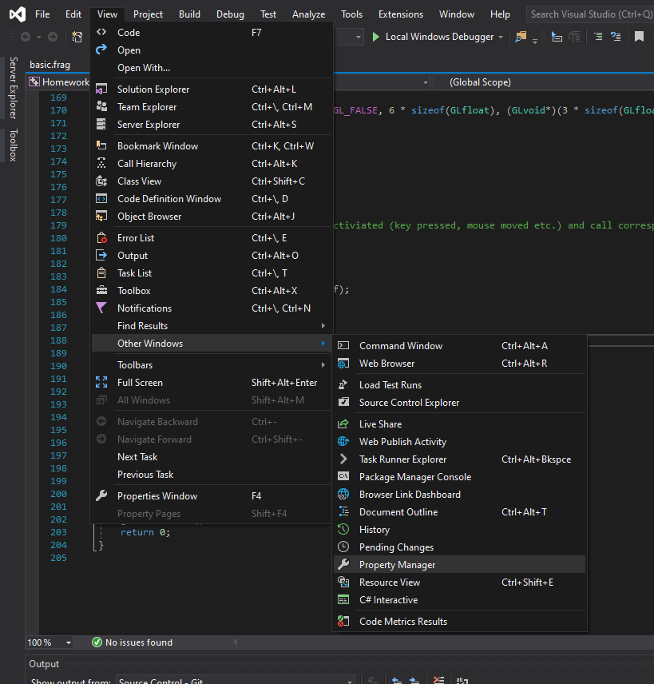
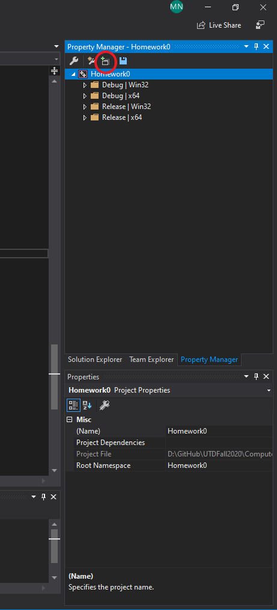

GLFW/GLEW/GLM/Freeglut/AntTweakBar and NanoGUI configuration

# Introduction

This is a windows version of GLFW/GLEW/GLM/FreeGLUT/AntTweakBar and nanogui binary file collection.

This version is ONLY used for Visual Studio 2019 Release(or Debug)/x64 mode (Probabily it is also compatible for VS2015 and VS2017).

For other versions of binary file, you can compile it on your own using [cmake-gui](https://cmake.org/download/) windows version.

GLEW, GLFW and GLM has been updated to below versions:

 - glew-2.1.0
 - glfw-3.3.2
 - glm-0.9.9.8


# Usage

<b> ** Do This In Order ** </b>

1: Add this folder into your "System Variables" with:

Variable name: OPENGL

Variable value: The path where the repo locates
```
e.g.  
    Variable name: OPENGL
    Variable value: D:\path\to\your\repo\folder
```

2: Add dll folder into your system's "Path":
```
e.g. 
    Variable name: Path
    Variable value: D:\path\to\your\repo\folder\dll
```

3: Create your own empty project in Visual Studio 2019

4: Add each OPENGL.prop + NANOGUI.prop files into Visual Studio Property Manager（Release/Debug x64）:
(If you are using freeglut or antweakbar you can add it seperately, but do not put them all together with GLFW. It may cause some error when running the code)

4.a:  View->Other Windows->Property Manager



4.b: Add Existing Property Sheet



Make sure the project name itself is selected before adding the existing property sheet. Select OPENGL.props and NANOGUI.props here(Please add OPENGL.props first) and they should appear in the debug and release folder once added

5: Set build configurations to run on x64

5.a: Project -> Properties -> Platform (at top)

​		Value: Active(x64)

5.b: Project -> Properties -> Linker -> Advanced -> Target Machine

​		Value: MachineX64

5.c: Build -> Configuration

​		Configuration: Release

​		Platform: x64

5: Run code test:

GLFW/GLEW/GLM Test:

Add opengl_example/helloworld.cpp provided by LearnOpenGL into your project

NanoGui Test:

Add nanogui_example/example3.cpp provided by NanoGUI into your project

Done

# FAQ

#### 1. Only add environment variables into "System variables", **DO NOT** add into "User variables".

#### 2. Sometimes the Windows may need to reboot before the changed variables take effect.

#### 3. If the added "System variables" couldn't take effect, please modify the .prop files by replacing "$(OPENGL)" with the true folder path. And copy the .dll files under your project's folder.
```
$(OPENGL)\glew\include --> path\to\your\repo\folder\glew\include
```

#### 4. Make sure you put **All Coding Files** under the project's folder, not just adding the .cpp files from somewhere else, this will ensure the dependency files could be found accordingly.

# Reference Links

Xcode verison of NanoGUI configuration: [http://jody-lu-blog.logdown.com/posts/1533525](http://jody-lu-blog.logdown.com/posts/1533525).

GLEW: [https://github.com/nigels-com/glew](https://github.com/nigels-com/glew)

GLFW: [https://github.com/glfw/glfw](https://github.com/glfw/glfw)

GLM: [https://github.com/g-truc/glm](https://github.com/g-truc/glm)

FreeGLUT: [http://freeglut.sourceforge.net](http://freeglut.sourceforge.net)

AntTweakBar: [http://anttweakbar.sourceforge.net/doc/](http://anttweakbar.sourceforge.net/doc)

NanoGui: [https://github.com/wjakob/nanogui](https://github.com/wjakob/nanogui)

Learn OpenGL: [https://github.com/JoeyDeVries/LearnOpenGL](https://github.com/JoeyDeVries/LearnOpenGL)

STB: [https://github.com/nothings/stb](https://github.com/nothings/stb)
